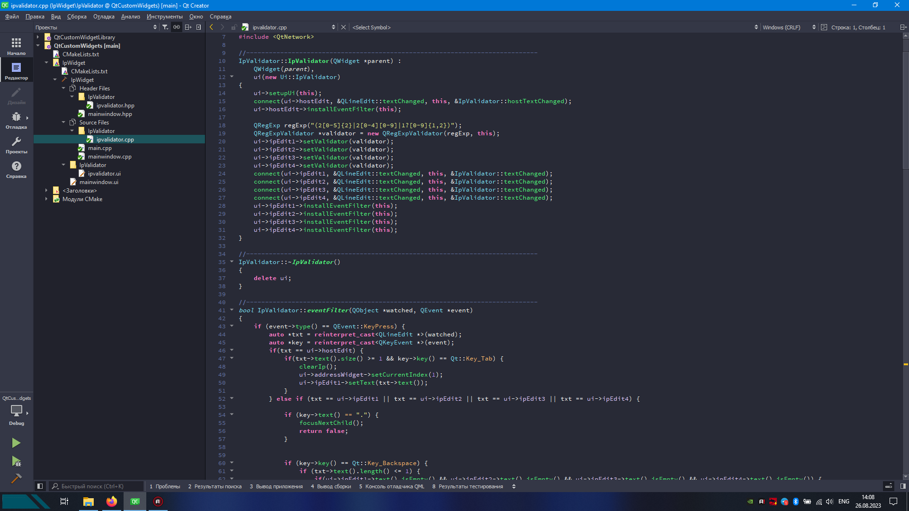

# Dracula for [Qt Creator](http://qt.io/ide)

> A dark theme for [Qt Creator](http://qt.io/ide).

## Install

All instructions can be found at [draculatheme.com/qtcreator](https://draculatheme.com/qtcreator).

## Team

This theme is maintained by the following person(s) and a bunch of [awesome contributors](https://github.com/dracula/template/graphs/contributors).

---
[Ergenekon Yigit](https://github.com/ergenekonyigit)

## License

[MIT License](./LICENSE)
